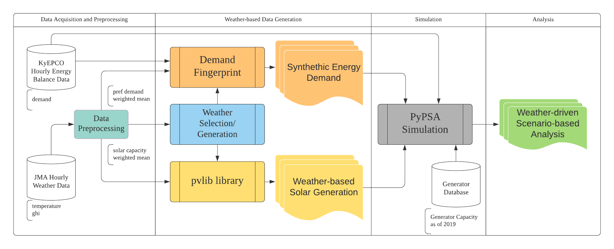

# Weather-driven Scenario Analysis for Decommissioning Coal Power Plants in High PV Penetration Grid
Samuel Matthew G. Dumlao, Keiichi N. Ishihara

Abstract
Despite coal being one of the major contributors of CO2, it remains to be a be cheap and stable source of electricity. However, several countries have turned to solar energy in their goal to green their energy generation. Solar energy has the potential to displace coal with support from liquefied natural gas. In this study, we conducted an hourly power flow analysis to understand the potential, limitations, and implications of using solar energy as a driver of decommissioning coal power plants. To ensure our results' robustness, we present a straightforward weather-driven scenario generation that utilizes historical weather and electricity demand to representative scenarios. This approach was tested in Japan's southernmost region since it represents a regional grid with high PV penetration and has a fleet of coal plants older than 40 years. The results revealed that solar could decommission 3.5 GW of the 7 GW coal capacity in Kyushu with the aid of LNG. It was discovered that beyond 12 GW, solar could not reduce the minimum coal capacity, but it could still reduce coal generation. By increasing the capacity from 10 GW to 20 GW, solar and LNG could reduce the emission by 28.10\%, but the cost will increase by 4.94\%. This effort requires 28 TWh of LNG generation, which increases the dependence on LNG. The balance between cost and CO2 reduction now becomes a policy decision. The results emphasized that investing in solar alone will not be enough, and another technology is necessary, especially for summer and winter. The weather-driven approach highlighted the importance of weather in the analysis as it has affected the results to varying degrees. The approach, with minor changes, could easily be replicated in other nations or regions provided that historical hourly temperature, irradiance, and demand data are available.

This repository serves as the supplementary material for the published journal. It contains the preprocessed data, the jupyter notebooks for the weather-based data generation, and the config files for the PyPSA simulation. 

- [Weather Selection](https://nbviewer.jupyter.org/github/smdumlao/demandfingerprint/blob/main/papers/coaldecommissioning/s1_weather_selection.ipynb)
- [Weather-based Solar Generation](https://nbviewer.jupyter.org/github/smdumlao/demandfingerprint/blob/main/papers/coaldecommissioning/s2_weather_based_solar_generation.ipynb)
- [Demand Generation](https://nbviewer.jupyter.org/github/smdumlao/demandfingerprint/blob/main/papers/coaldecommissioning/s3_demand_generation.ipynb)

